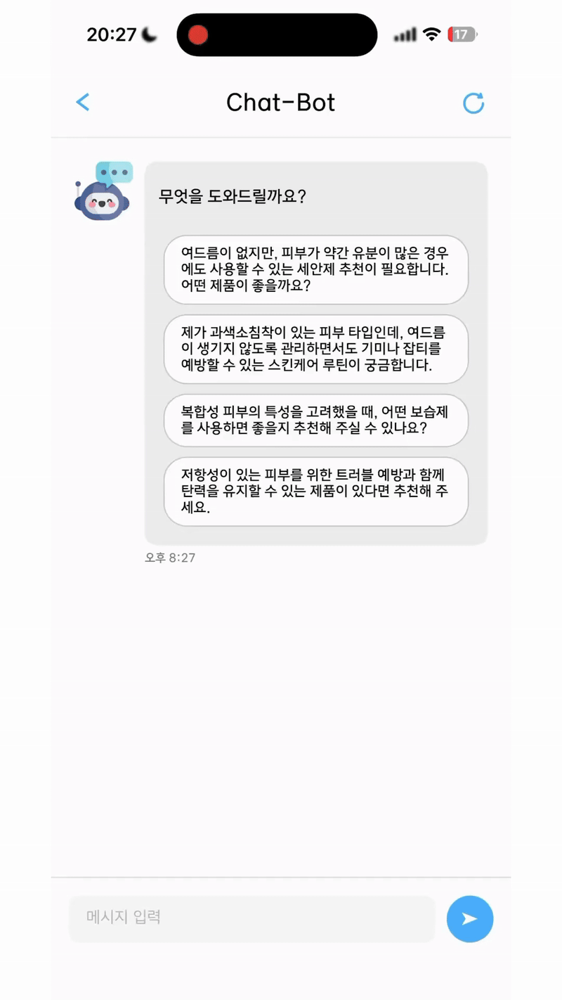
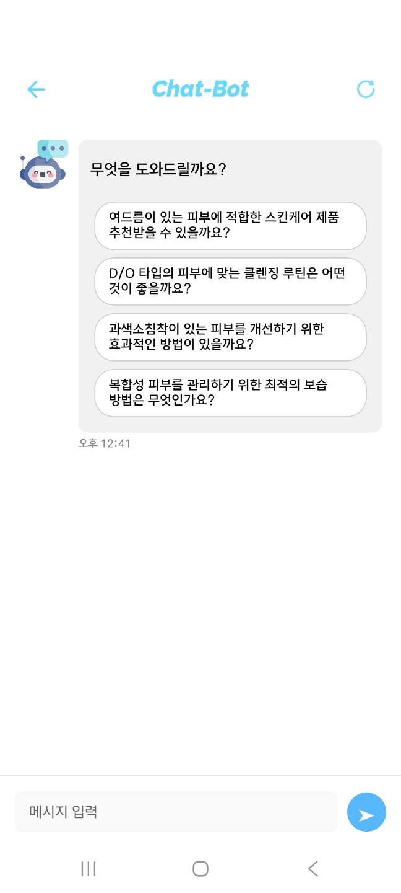
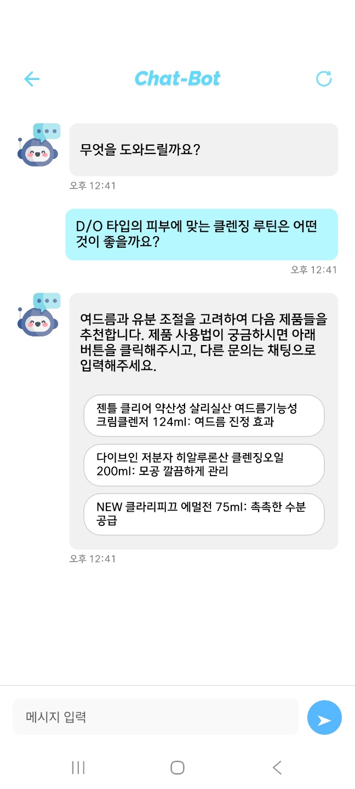
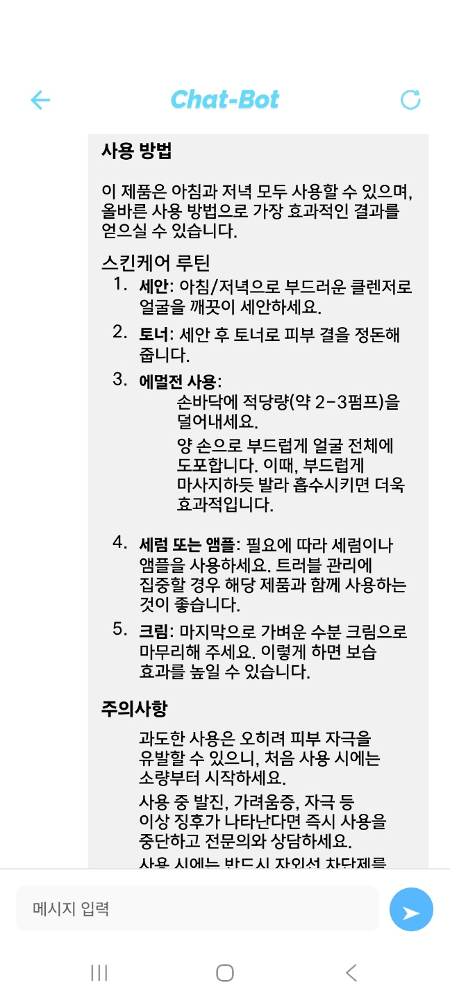
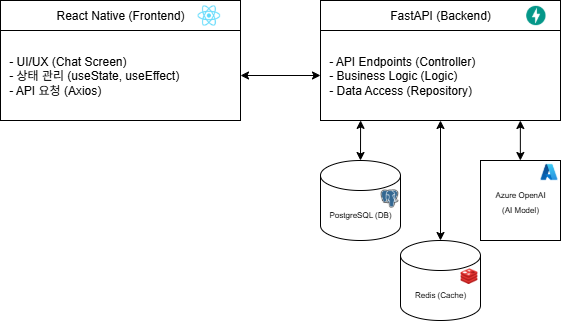

# AI-SkinView 스킨케어 추천 챗봇

사용자의 피부 데이터(바우만 피부타입 설문 + 안면 분석 수치)를 바탕으로 맞춤 스킨케어 제품을 추천하는 대화형 챗봇. FastAPI 백엔드와 React Native(Expo) 모바일 앱으로 구성.

> 팀 프로젝트 **AI-SkinView**(피부 분석 모바일 앱, 6인)에서 단독 담당한 **AI 챗봇 모듈**을 별도 저장소로 분리하고 모놀리식 구조를 레이어드 아키텍처로 리팩터링한 결과물.
> 팀 전체 저장소: [skinview-team-project](https://github.com/SJLee-83/skinview-team-project)

데모 영상: [YouTube (59초)](https://youtube.com/shorts/Shnw9ZDk6kM?feature=share)

## 데모

| 데모 | 추천 질문 자동 생성 | 제품 추천 | 사용법·프리셋 저장 |
| :---: | :---: | :---: | :---: |
|  |  |  |  |

## 동작 방식

상태 기반 다단계 대화.

1. **추천 질문 생성**: 사용자의 피부 데이터를 바탕으로 질문 후보를 자동 생성해 버튼으로 제시
2. **의도 분류**: 입력을 "제품 추천 / 단순 대화"로 분류(gpt-4o-mini, 출력이 허용 범위 밖이면 기본값 폴백)
3. **RAG 제품 추천**: 피부 데이터와 질문을 임베딩한 뒤 pgvector 코사인 거리(`<=>`)로 제품 3종을 검색하고 LLM 이 추천 소개글과 버튼 텍스트 생성
4. **사용법 안내·프리셋 저장**: 선택한 제품의 사용법을 생성하고 프리셋으로 저장

대화 상태(`initial_message → product_recommendation → product_usage`)와 대화 기록은 Redis 세션(TTL 300초)에 보관.

## 아키텍처

프론트엔드(React Native)와 백엔드(FastAPI)를 분리한 클라이언트-서버 구조. 백엔드는 컨트롤러 → 서비스 → 리포지토리 / 캐시 계층으로 나누고, FastAPI `lifespan` 에서 DB·Redis·Azure OpenAI 클라이언트를 조립해 서비스에 주입.



```
skinview-chat-backend/
  main.py                  # FastAPI 앱 + lifespan 의존성 조립
  app/
    api/                   # 컨트롤러 (라우팅)
    services/              # chat_service(대화 상태 머신), openai_service
    repositories/          # DB 접근 (사용자·제품·프리셋, pgvector 검색)
    caching/               # Redis 세션 캐시
    core/                  # 작업별 프롬프트
skinview-chat-frontend/    # React Native (Expo) 채팅 앱
```

## 기술 스택

**Backend**: Python 3.11+, FastAPI, Uvicorn, PostgreSQL + pgvector, psycopg2, Redis, Azure OpenAI(gpt-4o-mini · 임베딩 모델), python-dotenv

**Frontend**: React Native (Expo SDK 53), Axios, React Navigation, react-native-markdown-display

## 실행 방법

### 사전 요구사항
- Python 3.11+, Node.js 18+
- PostgreSQL (pgvector 확장 + 제품 임베딩 데이터 적재 필요)
- Redis
- Azure OpenAI 리소스 (chat·embedding 배포)

### 백엔드
```bash
cd skinview-chat-backend
python -m venv .venv
source .venv/bin/activate          # Windows: .venv\Scripts\activate
pip install -r requirements.txt
cp .env.example .env               # .env에 Azure / DB / Redis 값 입력
uvicorn main:app --host 0.0.0.0 --port 8000
```

### 프론트엔드
```bash
cd skinview-chat-frontend
npm install
cp .env.example .env               # EXPO_PUBLIC_API_URL에 백엔드 주소 입력
npx expo start
```

## 설계 결정

- **대화 분기를 LLM 판단에서 상태별 버튼으로 전환**: 초기에는 LLM 이 2\~3갈래 분기를 판단했으나 의도와 다른 분기로 진행되는 오판이 발생. 상태별 다음 행동을 버튼으로 제시해 분기를 고정한 뒤 상태 전이 오류 해소
- **LLM 출력 화이트리스트 검증**: 의도 분류 결과가 허용 값 밖이면 기본값으로 폴백해 임의 문자열이 상태 머신에 유입되지 않도록 차단
- **레이어드 분리**: 모놀리식 `ChatDAO` 를 컨트롤러/서비스/리포지토리/캐시로 분리. 오류 발생 계층 식별이 빨라진 반면, 리팩터링 중 상태 전이 키(`button_text`) 누락으로 2개 상태가 도달 불가한 회귀 버그가 생겼고 테스트 부재로 뒤늦게 발견·수정(2026-07-12)
- **RAG 적용 범위**: 기존 제품 데이터를 임베딩해 검색·주입하는 방식으로 파인튜닝 없이 도메인 추천 구성. 추천 품질의 정량 측정은 미실시

## 참고
- 측정된 정량 성과(추천 정확도 등) 없음. 동작은 데모 영상으로 확인
- 제품 임베딩 데이터와 DB 스키마는 저장소 미포함
- 테스트 코드 없음
